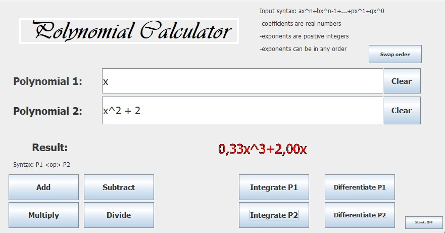
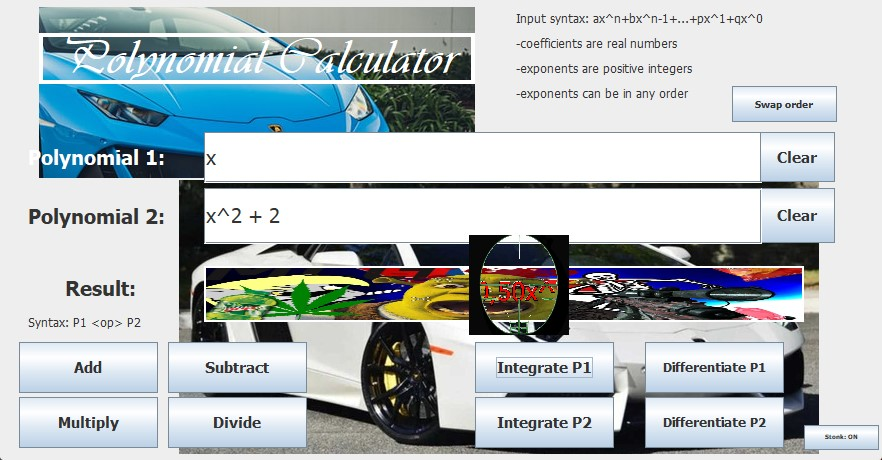

# Polynomial Calculator

 

## Assignment Objective

The main objective of this work is to propose, design, and implement a polynomial calculator capable of performing addition, subtraction, multiplication, division, integration, and differentiation operations. The calculator operates on entry data represented by two fields, each describing the polynomial's coefficients and exponents, and communicates the result through the output data, which is displayed after each operation.

### Secondary Objectives

- Utilize basic principles of Object-Oriented Programming (OOP) such as abstraction, encapsulation, inheritance, and polymorphism.
- Utilize the "Map" collection for storing the polynomials.
- Implement the aforementioned operations.
- Create a user interface using Java Swing.
- Take advantage of JUnit for efficient testing.

## Problem Analysis, Modeling, Scenarios, Use Cases

A polynomial is modeled as a series of monomials represented as "ax^b", where "a" is the coefficient and "b" is the exponent. The application efficiently models this using the Map Collection for storing each monomial. The application processes polynomials by checking their syntax and correctness before performing operations.

## Implementation

The core of the application consists of two classes: `Polynomial` and `Operation`. The `Polynomial` class stores the polynomial using a TreeMap in reverse order, where the exponent represents the key and the coefficient represents the value. The `Operation` class implements the six necessary operations: addition, subtraction, multiplication, division, integration, and differentiation.

The graphical interface utilizes Java Swing with an absolute layout. Each element, including labels, text boxes, and buttons, is customized for usability. Additional features such as "Stonk mode" and meme-themed result textboxes are included for entertainment.

## Conclusions

This project provided valuable learning experiences, including working with regex operations for string manipulation and the importance of automated testing in large applications. Future developments could include handling decimal and negative exponents, as well as improving the usability of the result textbox for very large polynomials.

## Usage

To run the application, simply execute the `App` class. Ensure you have Java installed on your system.

## Cloning Instructions

To clone this repository, run the following command in your terminal:

```bash
git clone https://github.com/AndreiE91/Trading-Calculator.git
```

